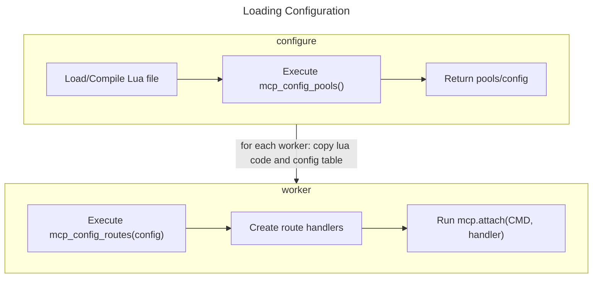
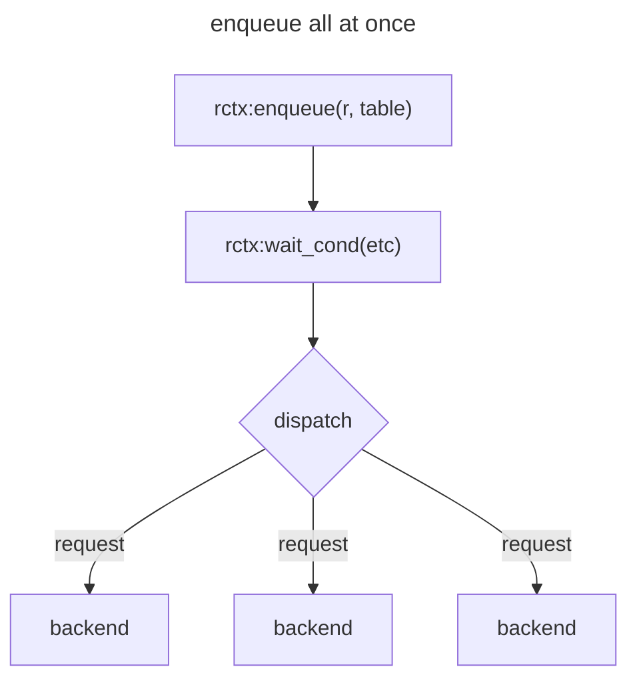
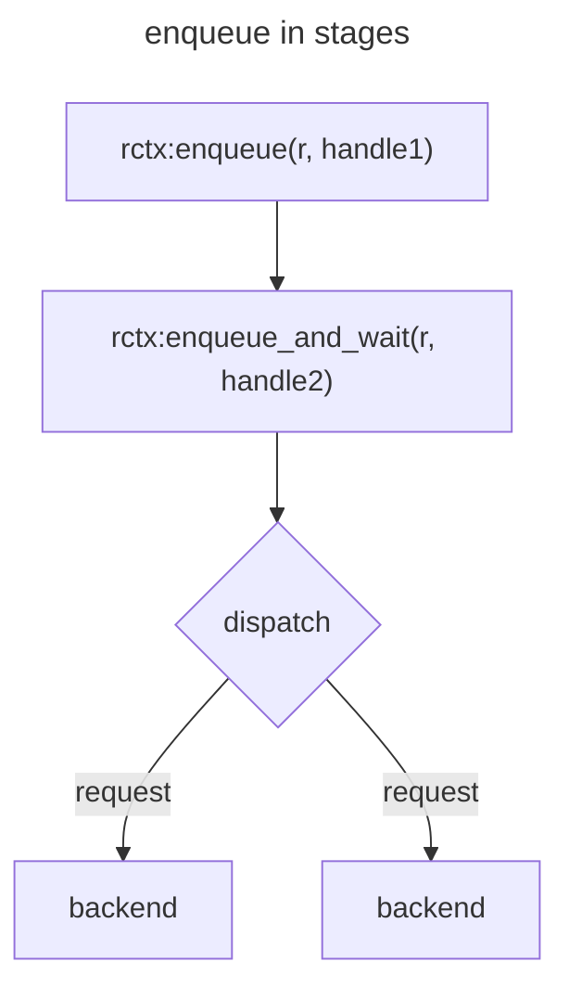

## Contents

- [Memcached Builtin Proxy](#memcached-builtin-proxy)
    - [What is it?](#what-is-it)
    - [Quick Start](#quick-start)
    - [Status](#status)
    - [Protocol Commands](#protocol-commands)
    - [Features](#features)
- [Examples and use cases](#examples-and-use-cases)
- [Architecture and Workflows](#architecture-and-workflows)
- [Configuration API](#configuration-api)
    - [Function generators and request contexts](#function-generators-and-request-contexts)
    - [Request context API and backend requests](#request-context-api-and-backend-requests)
        - [When requests dispatch to backends](#when-requests-dispatch-to-backends)
        - [Where is the results table?](#where-is-the-results-table)
    - [Router objects](#router-objects)
    - [Backend Objects](#backend-objects)
        - [What is a Backend](#what-is-a-backend)
        - [Why are backends separate from pools?](#why-are-backends-separate-from-pools)
        - [The backend object cache](#the-backend-object-cache)
        - [Backend API](#backend-api)
    - [Pool Objects](#pool-objects)
        - [What is a pool](#what-is-a-pool)
        - [Pool API](#pool-api)
        - [Pluggable key hashing](#pluggable-key-hashing)
        - [Pluggable key distribution](#pluggable-key-distribution)
    - [Programming caveats](#programming-caveats)
        - [Global values and config reloads](#global-values-and-config-reloads)
    - [General API documentation](#general-api-documentation)
- [FAQ](#faq)
    - [Why Lua?](#why-lua)
    - [Why not LuaJIT?](#why-not-luajit)
    - [Why not use a mesh router?](#why-not-use-a-mesh-router)
    - [What happens to in-flight requests on config reload?](#what-happens-to-inflight-requests-on-config-reload)

<!-- end toc 3 -->

# Memcached Builtin Proxy

## What is it?

A proxy speaking the memcached text and meta protocols designed for managing
clusters of memcached servers. It is fast, flexible, trivial to build and
deploy. Since it is built into memcached and scriptable using Lua (5.4), many
topologies, tricks, and deployment options are possible.

Most existing memcached proxies reflect the architecture of the companies
which originally made them. With the internal proxy, the "route handlers" are
small Lua functions which pass requests into pools of servers. This allows it
to not only emulate most existing proxies, but adapt more closely to your own
architecture.

## Quick Start

Requires memcached version 1.6.23 or newer. If you run into trouble, you can
try the [next branch](https://github.com/memcached/memcached/tree/next) in
case a fix has already been found.

You can use Docker to try the latest code.
This image expects a "config.lua" to be in the directory
You will need to start backend memcached's on your own!
```sh
docker run -v /path/to/config/directory:/config:ro --publish 11211:11211 \
    dormando/memcached:next-proxy
```

A configuration flag is necessary to enable the feature:
```sh
./configure --enable-proxy
make
make test
```

If building from the `next` git branch, you will need to run a script to grab
some vendored code:
```sh
cd vendor/
./fetch.sh
cd ..
./configure --enable-proxy
make
make test
```

Unless you want to write your route handlers from scratch, you need a route
library. We supply [a route library](https://github.com/memcached/memcached-proxylibs/tree/main/lib/routelib) for ease of use. Note that future releases should include this library directly, so you will not always need to download it separately.

Please see the [routelib README](https://github.com/memcached/memcached-proxylibs/blob/main/lib/routelib/README.md) for a quick start guide.

You can route commands to the specified pools by adding "foo/" or "bar/" to
the key, ie:

`get foo/a\r\n` or `get foo/someotherkey\r\n`

## Status

At this stage API functions are mostly stable, but are still subject to
occasional change. Most changes in functionality will be either additions or
with a backwards-compatible deprecation cycle.

After 1.6.23, we do not expect major core changes to the API. We will stick to
incremental improvements.

## Protocol Commands

The following commands are relevant for controlling memcached proxy

- `stats proxy`: prints proxy-specific stats counters. Includes dynamically
  created counters from the lua configuration.

- `watch proxyreqs|proxyevents|proxyuser`: watch commands for streaming logs
specific to the proxy.

- Sending a `SIGHUP` signal to memcached will cause the proxy to reload its
  configuration. This does not interrupt active traffic.

## Features

* Supports most of the text and meta protocols
* Dynamically configured backend pools and route handling
* Pluggable key distribution hashing algorithms
* Reduces connections to backend servers
* Use of Lua coroutines allows procedural programming style
* Able to selectively override commands, or serve from memcached embedded in
  the proxy
* Design routes to precisely fit your needs via simple Lua
* Flexible topologies: Run as a sidecar client, a large border proxy, or
  directly on an existing pool of servers
* Fast: all performance critical code is still C. Minimal Lua is executed for
  routing requests to backends.

Roadmapped features:
* Expanded API for manipulating request data easily
* TLS support for backend connections (frontend TLS is already supported)

---

# Examples and use cases

See [this document on example architectures](/ProxyExamples) for
different methods of deploying and using the proxy.

---

# Architecture and Workflows

See [this document on architecture](/ProxyArch) for details on the proxy's
thread components and how various subsystems work.

---

# Configuration API

To load the configuration, a dedicated thread first compiles the Lua code. It then calls the function `mcp_config_pools`, which loads all backends, collects them into pools, and returns a Lua table holding all of the final pool objects. Next, for each worker thread, they each execute `mcp_config_routes`. This function is expected to set up route handling (code that matches requests to a pool), and sets the command hooks that memcached will call (ie; hooks on get, set, and so on).



The proxy flow starts by parsing a request (ie: `get foo`) and looking for a function hook for this command. If a hook exists, it will call the supplied function. If no hook exists, it will handle the request as though it were a normal memcached.

In Lua, this looks like: `mcp.attach(mcp.CMD_GET, function)` - Functions are objects and can be passed as arguments. The function is called within a coroutine, which allows us to designs routes procedurally even if they have to make a network call in the middle of executing.

The function is called with a prototype of:
```lua
function(request)

end
```

The most basic example of a valid route would be:
`mcp.attach(mcp.CMD_GET, function(r) return "SERVER_ERROR no route\r\n" end)`

For any get command, we will return the above string to the client. This isn't very useful as-is. We want to test the key and send the command to a specific backend pool; but the function only takes a request object. How are routes actually built?

The way we recommend configuring routes are with _function closures_. In lua functions can be created capturing the environment they were created in. For example:

```lua
function new_route()
  local res = "SERVER_ERROR no route\r\n"
  return function(r)
    return res
  end
end

mcp.attach(mcp.CMD_GET, new_route())
```

In this example, `new_route()` _returns a function_. This function has access to the environment (`local res = `) of its parent. When proxy calls the `CMD_GET` hook, it's calling the function that was returned by `new_route()`, not `new_route()` itself. This function uselessly returns a string.

This should give you enough context to understand how the libraries in [the proxylibs repository](https://github.com/memcached/memcached-proxylibs) are implemented.

Since we have a real programming language for both configuration and the routes themselves, we can write loops around patterns and keep the configuration short.

## Function generators and request contexts

NOTE: This information is only useful for people intending to develop a route
library or extend `routelib`. End users should read the
[routelib](https://github.com/memcached/memcached-proxylibs/blob/main/lib/routelib/README.md) README.

To achieve high performance while still allowing dynamically scriptable route
handling, we must A) pre-create data, strings, etc and B) avoid allocations,
which avoids Lua garbage collection. We also need to carefully manage the
lifecycle of pools and backends used by the proxy, and maintain access to
useful context for the duration of a request.

This requires wrapping request handling functions _with context_

When a request is processed by the proxy, it needs to first acquire a _request
context slot_. This provides a function that will execute a request. After a
request is complete the slot may be _reused_ for the next request. This also
means we need _as many slots as there are parallel requests_. If a worker is
processing three `get` requests _in parallel_, it will need to create three
contexts in which to execute them.

We use a function generator to create this data. This also allows us to
pre-create strings, validate arguments, and so on in order to speed up
requests.

A minimal example:

```lua
function mcp_config_routes(pool)
    -- get a new bare object.
    local fgen = mcp.funcgen_new()
    -- reference this pool object so it cannot deallocate and be lost.
    -- note that we can also reference _other function generators_,
    -- providing us with a graph/tree/recursive style configuration.
    local handle = fgen:new_handle(pool)

    -- finalize the function generator object. When we need to create a new
    -- slot, we will call `route_handler`, which will return a function
    fgen:ready({ f = route_handler, a = handle })

    -- attach this function generator to `get` commands
    mcp.attach(mcp.CMD_GET, fgen)
end

-- our job is to pre-configure a reusable function that will process requests
function route_handler(rctx, a)
    -- anything created here is available in the function below as part of its
    -- local environment
    local handle = a
    return function(r)
        -- the rctx object is unique to _each slot generated_
        -- it gives us access to backend API calls, info about the client
        -- connection, and so on.
        return rctx:enqueue_and_wait(r, handle)
    end
end
```

---

## Request context API and backend requests

Function generator API
```lua
-- creates a new factory object. pass this object as the function argument
-- to mcp.attach() or rctx:new_handle.
fgen = mcp.funcgen_new()

-- references a pool or funcgen into this funcgen and returns a handle. This
-- handle is later used during request processing to enqueue requests.
handle = fgen:new_handle(pool||funcgen)

-- this marks the funcgen generator as ready to run, and passes in a few more
-- more arguments.
fgen:ready({
    -- this is the function factory that we will use. see below for detail
    f = route_handler,
    -- an arbitrary argument (bool/string/num/table) to pass to route_handler
    a = argument,
    -- a name for this function generator, for 'stats proxyfuncs' output
    n = string,
})

-- 'route_handler' is called _once_ per request slot that is generated. If
-- there are many parallel in-flight requests this can be called many times.
-- The output function is cached and reused until the configuration is
-- reloaded.
-- 'route_handler' has a prototype of:
function route_handler(rctx, arg)
    -- 'rctx' is a new request context object that was just created.
    -- 'arg' is the argument passed in 'a' above via fgen:ready()
    -- this must return a new function with the following prototype. It is
    -- then called to serve individual requests repeatedly.
    return function(r)
        -- code
    end
end
```

Request factory API. These API calls are available from the function that is
generating the function to ultimately serve requests.
```lua
-- execute this function callback when this handle has been executed.
-- this allows adding extra handling (stats counters, logging) or overriding
-- wait conditions
rctx:handle_set_cb(handle, function)

-- callbacks look like:
local cb = function(res, req)
   -- the result and request executed are available for examination

   -- we can _optionally_ return a condition, in case we want to make our own
   -- judgement of what GOOD/OK/ANY means.
   return mcp.WAIT_ANY

   -- we can also return a second argument if we want to end a wait condition
   -- early
   return mcp.WAIT_ANY, mcp.WAIT_RESUME
end

rctx:handle_set_cb(handle, cb)
```

Request handling API

```lua
-- to be called from the request function, queues up a request against the
-- designated slot handle, or an array style table of N handles
rctx:enqueue(r, handle || table)

-- Directly returns a single result object after waiting on
-- a specified unqueued handle.
res = rctx:enqueue_and_wait(r, h)

-- Directly returns a single result object after waiting on
-- a specified prequeued handle.
res = rctx:wait_handle(h)

-- Asynchronously waits for up to "count" results out of all currently
-- queued handles. Takes a mode to filter for valid responses to count:
-- mcp.WAIT_OK, WAIT_GOOD, WAIT_ANY
-- WAIT_FASTGOOD will wait for the first "Good" (ie; hit) request or N total
-- responses
-- if "0" is supplied for count, it will execute queued requests and
-- immediately resume.
num_good = rctx:wait_cond(count, mode)

-- returns result object if the queue response was considered "Good", else
-- nil.
rctx:res_good(handle)
-- same but "WAIT_ANY"
rctx:res_any(handle)
-- same but "WAIT_OK"
rctx:res_ok(handle)
-- returns result object, mcp.RES_GOOD|OK|ANY
res, mode = rctx:result(handle)
```

### When requests dispatch to backends

Requests are _enqueued_ with the various `enqueue*` functions.
The requests are not immediately transmitted to the backends. Whenever an
`rctx` is asked to _wait_, ie: both for `enqueue_and_wait` and `wait_cond`,
_all_ enqueued requests are immediately executed.

This means if you enqueue two requests, then queue and wait on a third, all
three requests are batched and executed simultaneously.





### Where is the results table?

This core API is designed to execute without causing _any Lua allocations_,
which includes tables being returned to the user. As such, our `wait`
functions cannot simply return a table of results.

However, when working with this API you will almost always have _handles_ for
all of the backends you are making requests against. Thus a common pattern
will be:

```lua
-- in generation phase
local handles = {}
for k, v in pairs(pools) do
   table.insert(handles, rctx:new_handle(v))
end

-- ... later, at request time
rctx:enqueue(r, handles) -- batch enqueue request to all handles
rctx:wait_cond(#handles) -- wait for all requests to finish
-- use the same table again to iterate the results
for x=1, #handles do
    local result = rctx:res_good(handles[x])
end

-- In this example we referenced our list of pools multiple times without
-- making any allocations.
```

---

## Router objects

Lets say we want to route requests to different pools of memcached instances
based on part of the key in the request: for this we use router objects.

Routers can achieve this matching efficiently without having to examine the
key inside Lua, which would result in many copies and regular
expressions.

```lua
-- Minimal example of a router. Here:
-- "get foo/etc" would be handled by the "funcgen_foo" handler
-- "get bar/etc" would be handled by the "funcgen_bar" handler
-- By default the router checks up to a "/" character for the map key.
local m = {
    foo = funcgen_foo,
    bar = funcgen_bar,
}
local router = mcp.router_new({ map = m, mode = "prefix", stop == "/" })
mcp.attach(mcp.CMD_GET, router)
```

Explanation of router options:
```lua
local r = mcp.router_new({
    -- a table of route handlers to requests to
    -- see "command maps" below for more info.
    map = m,
    -- mode can be (default "prefix"):
    -- "prefix": we check the prefix of the key against the map.
    -- stop matching when the "stop" character is seen.
    -- "anchor": we check for and skip characters in "start", then match until
    -- "stop" is seen.
    mode = "etc",
    -- start looks for these characters at the start of a key and skips them
    -- before finding a sub string to match against. It is "" by default
    -- if start is a single character, and optimized algorithm is used.
    -- it must be 5 characters or less.
    start = "_",
    -- stop will stop matching at this character, and what came before this
    -- string to check against the map. It is "/" by default.
    -- It follows the same rules as "start": single characters are faster, max
    -- is 5.
    stop = "/"
    -- If the request does not match against the map, use this route handler
    -- by default.
    default = funcgen
})

-- command maps

-- A router map entry may either reference a funcgen handler directly, or
-- another table which further maps commands to funcgen handlers
local m = {
    -- any "foo/etc" key for get/set/touch will route here
    foo = handler1,
    bar = {
        -- only "get bar/etc" will use handler2.
        [mcp.CMD_GET] = handler2,
        -- if a CMD_ANY_STORAGE entry is also provided, use if no exact match
        [mcp.CMD_ANY_STORAGE] = handler3,
        -- if no CMD_ANY_STORAGE is provided, and no exact CMD match, the
        -- router's default entry is used.
    }
}
local r = mcp.router_new({ map = m })
mcp.attach(mcp.CMD_ANY_STORAGE, r)
```

---

## Backend Objects

### What is a Backend

A backend object describes a single memcached server that you want the proxy
to talk to. Collections of backend objects are assembled into Pools.

Backends _cannot be directly used_ in route handlers. They _must_ be wrapped in
a pool first.

### Why are backends separate from pools?

We allow the same backend object to be referred in multiple pool objects. This
can be useful in scenarios like adjusting the size of a pool over time. This
usually requires temporarily creating two pools: if expanding, one with an
extra backend, then the other with the original set. Since we can share
backend objects between the two, we avoid creating excess TCP connections.

This also allows us to customize some options on a per-object basis. Though
whether or not this ability is exposed to the user will depend on their route
library.

### The backend object cache

Backends are stored indexed by their label. When you attempt to
create a backend the proxy will check if it already has an object with that
label. If it does, it will check the arguments supplied and replace the object
if something has changed (ie; ip address, port, timeout settings, etc).

This has both a large speedup on reloading configurations and avoids having
a configuration reload double all TCP connections by creating all new objects.

Since the configuration code doesn't have to manage this cache, it can simply
describe objects any way it wants and the proxy will handle updating them when
they change.

### Backend API

Allowable from `mcp_config_pools`

Short form backend creation
```lua
-- create a backend object from a short description
mcp.backend(label, host|ip, port)

-- label: uniquely identify this backend object so it may be reused
-- host|ip: is the hostname or IP address of the server, though IP addresses are
-- strongly recommended as of this writing since DNS lookups can cause
-- performance issues.
-- port: is the service port the server is listening on.

-- The `label` of a backend gives it a unique cache id. If a backend has the
-- same label and options during reload, the underlying connections are reused.
```

Long form backend creation. This allows overriding some global settings on a
per-backend basis.
```lua
mcp.backend({
    -- uniquely identify this backend object so it may be reused
    label = "string",

    -- the hostname or IP address of the server, though IP addresses are
    -- strongly recommended as of this writing since DNS lookups can cause
    host = "string",

    -- the service port the server is listening on.
    port = number,

    -- the number of TCP connections to use for this object. The proxy will
    -- attempt to spread requests across multiple sockets. Useful if you have
    -- a lot of large items.
    -- This can create 'count' connections *per worker thread*, so be careful.
    -- Do not set to a large number! 1 is the default, 2 is probably enough.
    connections = count,

    -- If true, any attempt to access this backend will result in immediate
    -- failure (`SERVER_ERROR backend failure`)
    down = true|false,

    -- These next options override global settings, see below for detail.
    -- seconds may be fractional, ie: 0.5 for 500ms or 2.75 for 2750ms
    -- mcp.tcp_keepalive
    tcpkeepalive = true|false,
    -- mcp.backend_failure_limit
    failurelimit = count,
    -- mcp.backend_connect_timeout
    connecttimeout = seconds,
    -- mcp.backend_retry_waittime
    retrywaittime = seconds,
    -- mcp.backend_read_timeout
    readtimeout = seconds,
    -- mcp.backend_flap_time
    flaptime = seconds,
    -- mcp.backend_backoff_flap_ramp
    flapbackofframp = seconds,
    -- mcp.backend_backoff_flap_max
    flapbackoffmax = seconds,
})
```

---

## Pool Objects

### What is a pool

Pool objects are (typically) very lightweight containers that hold references
to backend objects. They also hold configuration for how to choose a backend
from a supplied key.

Normally you would expect a "route handler" to take a list of backends and be
able to do the key mapping itself, which is more flexible. For us we need to
manage performance carefully and want to minimize the amount of Lua being
executed. Thus pools objects are fully implemented in C.

The default key distribution method for pools is to use XXHash to hash the
keys, and Jumphash algorithm to distribute keys across a list of backends.
This is a very fast and very even distribution method. If you use ketama or
similar hashing it is highly recommended to try to convert to this newer
method.

If other methods are desired for compatibility or otherwise, both the hashing
algo and key distribution algo can be overridden in C.

### Pool API

Allowable from `mcp_config_pools` function:

```lua
mcp.pool({backend1, backend2, etc}, {
    --  If true, backends listed in this pool use a shared thread for IO
    -- access, reducing TCP connections. If false, each memcached worker
    -- thread maintains its own backend TCP socket for this pool.
    -- [TODO: add anchor for details]
    iothread = true|false,

    -- If supplied this prefix will be added to the lables of all specified
    -- backends. This means this pool object will get unique TCP sockets for
    -- its backends. Usable for dedicating different sockets for different
    -- purposes (gets vs sets).
    beprefix = string,

    -- A string to "seed" the hash algorithm for this pool. If two pools are
    -- created with the same backends, but different seeds, they will
    -- distribute keys differently to the backends.
    seed = string,

    -- See also `filter_conf`. This allows directing sets of related keys
    -- onto the same backend nodes, improving batch performance.
    -- If "stop": Will hash only the first part of a key until the configured
    -- stop text. IE, a three character string like '|#|'
    -- If "tags": Will hash only the parts of a key between two given
    -- characters. IE, "{}" or "$$"
    filter = string,

    -- Configuration for the requested filter type. See above for examples.
    filter_conf = string,

    -- Allow overriding the hash or distribution algorithms.
    -- TODO: Docs.
    hash = object,
    dist = object,
})
```

---

### Pluggable key hashing

---

### Pluggable key distribution

---

## Programming caveats

### Global values and config reloads

When we create route handlers we aim to put all of the context/data that they
use in the _environment of the function_. When configuration reloads happen,
all of the code can change. Pre-existing requests might be waiting for a
backend response, and we don't want their code to change out from under them.

So long as all data is in the _environment of the function_ then reloads
cannot break in-flight requests. However if you rely on globals and those
globals may change during a reload, you can get into trouble.

Example:
```lua
function generator(rctx, arg)
    -- good: retrieve a toggle from a passed in argument
    local toggle = arg.toggle

    -- okay: retrieve a toggle from a global during function generation
    local toggle = GLOBAL_TOGGLE_BOOLEAN

    local handle = etc

    return function(r)
        if toggle then
            -- some specific prep work
        else
            -- different prep work
        end

        local res = rctx:enqueue_and_wait(r, handle)

        if toggle then
            -- if a reload happened between the first toggle check and this
            -- one, and instead of 'toggle' we directly referenced
            -- GLOBAL_TOGGLE_BOOLEAN, we could make a mistake.
        else
            -- as above
        end
    end
end
```

This goes the same for something like a lookup map. In lua, tables and objects
are passed around by reference. This means if we are generating a lookup table
at load time, and passing it into a function, it is perfectly safe to use.

Example:
```lua
function mcp_config_routes(c)
    -- skip: various prep work.

    -- this makes a new top level lookup table.
    local lookup = { one = 1, two = 2, three = 3 }
    -- which we then pass into a function generator
    fgen:ready({ f = generator, a = lookup })
    -- the next time a reload happens, it doesn't matter if `lookup` changes,
    -- because since we make lookup within mcp_config_routes(), it will be
    -- unique on every load
end
```

Another example:
```lua
-- lookup is now a global variable
lookup = { one = 1, two = 2, three = 3 }

function mcp_config_routes(c)
    -- skip: various prep work.

    -- This is still okay, since 'lookup' is being overwritten by a new table
    -- during reload, and here we are passing a reference to that table.
    fgen:ready({ f = generator, a = lookup })
end
```

Bad example:
```lua
-- lookup is a global table
lookup = { one = 1, two = 2, three = 3 }

function mcp_config_routes(c)
    -- not passing the reference in.
    fgen:ready({ f = generator })
end

function generator(rctx)
    return function(r)
        -- could break, since we are now directly referencing the global
        -- table, which can change. many times this won't matter, but a best
        -- practice is to always pass referenecs down when needed.
        local foo = lookup[input]
    end
end
```

---

## General API documentation

Allowable from `mcp_config_pools` function:

- `mcp.add_stat(number, label)`: Creates a fast custom counter, which are
  viewable via the `stats proxy` command. Use a unique constant number for the
`number` argument, and a descriptive text for `label`.

Settings:
```lua
-- Time in fractional seconds to wait for a connection before retrying
mcp.backend_connect_timeout(seconds)

-- Time in whole seconds for waiting before attempting to make a new
-- connection after a backend has reached the failure limit and been marked bad.
mcp.backend_retry_waittime(seconds)

-- Time in fractional seconds to wait for a read response once writing requests
-- to a backend.
mcp.backend_read_timeout(seconds)

-- Number of times a backend can fail to properly connect and validate in a
-- row before being marked as bad.
mcp.backend_failure_limit(seconds)

-- Whether or not all new backends use TCP Keepalive
mcp.tcp_keepalive(bool)

-- Fast fail if more than this many requests are actively being processed.
mcp.active_req_limit(count)

-- Fast fail if more than roughly this many kilobytes are actively in use
-- by requests for request or response value buffers.
mcp.buffer_memory_limit(kilobytes)

-- Number of seconds a backend must be held open without errors or else it
-- is considered to be flapping. (TODO: docs)
mcp.backend_flap_time(seconds)

-- A small fractional second value. It is multiplied into `retry_waittime`
-- by the number of times it has flapped, providing a backoff for how often
-- to retry unhealthy servers.
mcp.backend_flap_backoff_ramp(seconds)

-- Maximum number of whole seconds to wait before retrying a flapping server.
-- Ensures servers with ephemeral issues are occasionally brought back in a
-- reasonable timeframe.
mcp.backend_flap_backoff_max(seconds)

-- Whether or not a backend is hanndled by worker threads or a dedicated IO
-- thread, by default.
-- disabled by default, which provides better scalability at the cost of more
-- TCP connections and less batching of backend syscalls.
-- This can be overridden in pool settings.
mcp.backend_use_iothread(false)
```

Allowable from `mcp_config_routes` function:

- `mcp.attach(CMD, function)`: Attaches a function to a command hook. See
  [Configuration API](#configuration-api) for details.
- `mcp.request(request, value)`: Takes a string `request` and creates a
  request object from it. This parses the request to ensure it is valid
protocol. Optionally a `value` string can be added to provide the value
portion of a set style request. `value` may also be a response object, the
proxy will internally copy the response value into the new object instead of
needing to copy through lua.
- `mcp.log(message)`: ships text `message` to a log stream viewable via `watch proxyuser`
- `mcp.log_req(request, response, detail)`: Produces detailed log line into
  `watch proxyreqs` stream by comparing the supplied request and response
objects. `detail` is a string that is also passed to the log entry.
- `mcp.log_reqsample(milliseconds, rate, allerrors, request, response,
  detail)`: This function allows conditionally logging detailed request logs,
same as `mcp.log_req`. `request`, `response`, and `detail` are the same.
`milliseconds`, if non-zero, will log all requests which took longer than this
limit to get a result. `rate`, if non-zero, will log an average of "one in
every `rate`" requests, allowing random sampling. `allerrors`, if `true`, will
always generate a log line if an error was generated instead of a typical
response (ie; backend down, malformed request/response, etc).

- `mcp.stat(number, change)`: Given an index number created from
  `mcp.add_stat`, adds the integer `change` to that counter. `change` may be
positive or negative.

Object methods:

(missing lots of documented methods right now)

request objects:
- `request:key()`: returns the key from the parsed request object
- `request:ltrimkey(number)`: removes number characters from the left side of the key.
- `request:rtrimkey(number)`: removes number characters from the right side of the key.
- `request:ntokens()`: the total number of arguments in the request
- `request:token(n, "token")`: fetches or replaces a token at this position in
  the request. If a blank ("") is passed as the second argument the token is
removed. This can be used, for example, to see or replace the TTL part of a SET
request.
- `request:vlen()`: length in bytes of the value attached to this request
- `request:has_flag('F')`: for use with [meta](/MetaCommands), a fast function
  for testing if a flag exists in the request string.
- `request:flag_token("F", "Freplacement")`: for use with
  [meta](/MetaCommands), a fast function for finding and modifying a request
line. Returns `(exists, previous_token)`, a bool on if the flag exists, and if
the flag has a token attached it will be returned in `previous_token`. If a
second argument is passed, it will be used to replace the flag and/or token
argument in the request. A blank ("") value will remove the flag entirely.
NOTE: If you run this command repeatedly on the same token, it will not return
previously updated values. This behavior may change in the future.

response objects:
- `resp:hit()`: whether a request was a successful hit, if that makes sense
  from the original request.
- `resp:ok()`: whether a request was successfully executed to the backend.
  For GET requests, both HIT and MISS are OK.
- `resp:line()`: for use with [meta](/MetaCommands), returns the full
  response header line.
- `resp:code()`: the response code. Common codes are:
  - `mcp.MCMC_CODE_OK`
  - `mcp.MCMC_CODE_STORED`
  - `mcp.MCMC_CODE_EXISTS`
  - `mcp.MCMC_CODE_MISS`
  -  TODO: document the rest.

---

# FAQ

## Why Lua?

I thought ya'll could use a break from YAML :) We use Lua and its
extensibility like glue: nearly everyone has different methods of managing
their configuration, and in most cases a simple lua script would be able to
parse output from such services or talk to them directly. A handful of for
loops and object reuses can remove tens of thousands of lines of generated
configuration.

For route handling our usage of Lua is more bold, but again it's simply glue.
Configurations for routes will tend to be wide but shallow: just a couple
small function calls based on the contents of the request, and then the
request is handed back off to the C side. Object methods written in C further
avoid copying strings/data to/from Lua for common operations.

Since the proxy integrates with memcached's existing systems, we can (over
time) ensure all large memory allocations are handled outside of Lua. The rest
of the tiny allocations, if any, are tied to a coroutine and released
immediately after the (typically under a millisecond) request/response.

## Why not LuaJIT?

For half the answer to this, please see [Why lua?](#why-lua) - for loading
configuration the performance difference isn't going to matter much. For route
handling very little work is done from Lua, which will be reduced or removed
as development continues.

When development started LuaJIT had a much more rocky status. Also Lua 5.4 has
a good number of language and performance improvements on its own.

## Why not use a mesh router?

Memcached's proxy is not intended to replace a mesh router; its scope is much
smaller and more performance focused. A mesh router may be highly confgurable,
with broad support, but will be very slow. Caching services (and in this case
a caching proxy) can be used to restore performance to a service migrated to a
mesh router; for cost or practicality reasons.

Many data queries don't or shouldn't go through a mesh router anyway. If you
want to speed up access to data storage from an application implemented as an
endpoint on a mesh router, a caching service is what sits behind that
endpoint but before its actual data storage.

## What happens to in-flight requests on config reload?

When the configuration is reloaded, `mcp_config_routes` gets called again.
During this process routes are assembled into functions and `mcp.attach()` is
called with these top level hooks. Any time a request comes in these top level
hooks are checked for their associated function.

This means once a request fires off its hook, it is immune from configuration
changes until it completes. Any new request coming in will see what's
presently configured in a hook and get the new code even as older requests are
being processed.

This does mean you have to be careful with using global variables in Lua: we
suggest the use of function closures for routes to avoid configurations
clashing.
