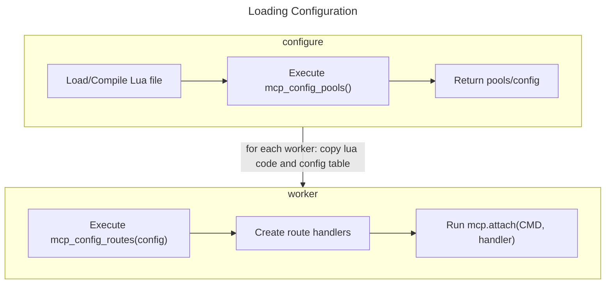
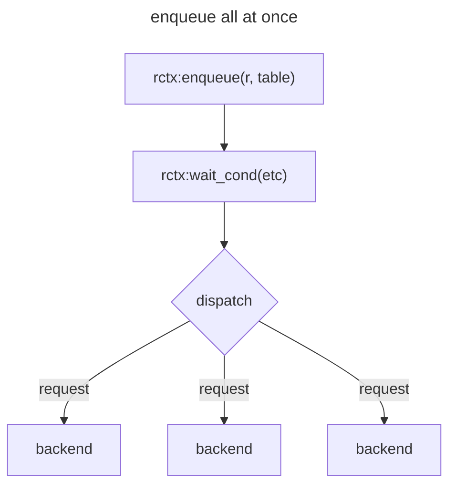
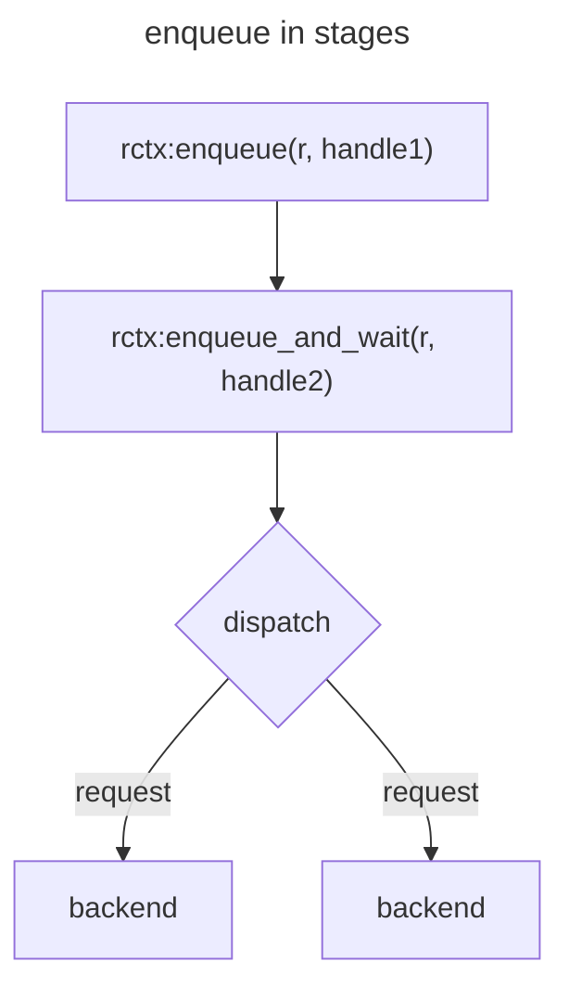

+++
title = 'Proxy API reference'
date = 2024-09-01T09:05:37-07:00
weight = 200
+++

This page provides a description of and reference to the Memcached built-in proxy API. These allow customization or replacement of the proxy's standard route library in advanced use cases.

Use this reference if you wish to make changes to the standard route library,
extend it with your own custom route handlers, or write your own fully custom
library from scratch.

For a general overview of the built-in proxy, see [Built-in proxy]().

We are catching up on a backlog of documentation. If you think something is
missing or find an error [please report it](https://github.com/memcached/memcached.github.io)

## Development status of the proxy API

API functions are mostly stable, but are still subject to
occasional change. Most changes in functionality will be either additions or
with a backwards-compatible deprecation cycle.

## Features

* Supports most of the text and meta protocols
* Dynamically configured backend pools and route handling
* Pluggable key distribution hashing algorithms
* Reduces connections to backend servers
* Able to selectively override commands, or serve data from memcached embedded in
  the proxy
* Design routes to precisely fit your needs via simple Lua
* Use TLS to connect to memcached backends
* Flexible topologies: Run as a sidecar client, a large border proxy, or
  directly on an existing pool of servers
* Fast: performance critical code is still C. Minimal Lua is executed for
  manipulating and deciding how to route requests.

## Configuration API {#configuration_api}

To load the configuration, a dedicated thread first compiles the Lua code. It then calls the function `mcp_config_pools`, which loads all backends, collects them into pools, and returns a Lua table holding all of the final pool objects. Next, each worker thread calls `mcp_config_routes`. This function is expected to set up route handers and sets the command hooks that memcached will call (ie; hooks on get, set, and so on).



## Configuration stages

As noted above, configuring the proxy happens in
two distinct stages. These stages use fully independent Lua VM instances: a
configuration instance, and one for each worker thread. This separation is
designed to improve the safety of reloading the config and for performance as
a separate "configuration thread" is used for more intense work.

If a configuration fails to execute on reload, in most cases, the proxy will
continue to run the old configuration.

The same Lua code file is used for all threads: it is loaded and compiled
once.

The first stage is to call `mcp_config_pools` from the "configuration thread".
This stage defines backends and organizes them into pools. It is also a good
place to decide on how keys and commands should be routed. A table tree of
information is then returned from this function. The proxy is not blocked or
otherise impacted while this function runs.

The second stage is to call `mcp_config_routes` from each "worker thread".
These VM's run independently for performance reasons: there is no locking
involved and any garbage collection happens per-thread instead of for the
whole process.

In this second stage we take information generated in the first stage to
create function generator objects, which produce coroutines that actually
process user requests. We also generate router objects that decide which
functions should handle a particular command or key prefix. Finally, we attach
either a function generator or a router object to the proxy's command hooks.

Since this second stage is executed in the same worker threads that handle
requests, it is a good idea to keep the code simple. Errors here can also
stop the process and are not easily recoverable.

```lua
function mcp_config_pools()
    -- create a table of pools, and route information
    local t = {}
    -- fill t with pools/information
    return t
end

function mcp_config_routes(t)
    -- Create function generators and routers.
    local router = -- see below
    -- Here we override any command. It is also possible to override only
    -- specific commands: ie: just override 'set', but handle 'get' as though
    -- we are not a proxy but a normal storage server.
    mcp.attach(mcp.CMD_ANY_STORAGE, router)
end
```

Our [Route
library](https://github.com/memcached/memcached-proxylibs/tree/main/lib/routelib)
can handle this for you and is a good abstraction to start from. For most
people the rest of this API reference can be used to create your own route
handlers. Since routelib handles the stages of execution, you can focus on
processing requests and nothing else about how the configuration is built.

---

## Extending routelib with new handlers

Examples for extending routelib can be found
[here](https://github.com/memcached/memcached-proxylibs/blob/main/lib/routelib/examples/)
- look for files that start with `custom`. The files are commented. More
  detailed information is repeated here.

### Loading custom handlers

You must instruct memcached to load your custom route handler files. If you
are already using routelib your start line may look like:

```
-o proxy_config=routelib.lua,proxy_arg=config.lua
```

If your custom route handler is defined in `customhandler.lua`, you need to
add it as an argument to `proxy_config`:

```
-o proxy_config=routelib.lua:customhandler.lua,proxy_arg=config.lua
```

This lets the proxy manage loading and reloading the configuration for you,
without having to focus too much on Lua.

### Custom handler configuration stages

As described above in [configuration stages](#configuration-stages) there is a
two-stage process to configuration loading. This needs to be taken into
account when writing custom handlers for routelib as well.

For routelib we call a `_conf` function during the first stage, and `_start`
during the second per-worker stage.

Also, we must register our handler with routelib via a call to `register_route_handlers` when the code is loading.

For example:
```lua
-- This function is executed during the first stage, in the configuration VM.
-- This is where we can check and transform arguments passed in from the
-- routelib config
function route_myhello_conf(t, ctx)
    -- User supplied arguments are in the `t` table.
    -- A `ctx` context object is also supplied, which can be queried for
    -- information about the handler, help with statistical counters, etc.
    t.msg = string.format("%s: %s", t.msg, ctx:label())
    -- Get an internal ID to later use as a global counter for how many times
    -- our hello function is called.
    if t.stats then
        ctx:stats_get_id("myhello")
    end

    -- This return table must be a pure lua object. It is copied _between_
    -- the configuration VM and each worker VM's, so special objects,
    -- metatables, and so on cannot be transferred.
    return t
end
```

Next, we define the `_start` routine, which creates a function generator. This
generator function is used to create coroutines used to process requests.

When a request is processed by the proxy, it needs to first acquire a _request
context slot_. This provides a lua function that will process a request. After a
request is complete the slot may be _reused_ for another request. This
means we need _as many slots as there are parallel requests_. If a worker is
processing three `get` requests _in parallel_, it will need to create three
contexts in which to execute them.

Pre-creating and caching request slots gives us good performance while still
using a scripting language to process requests.

```lua
-- Here we prepare the generator that will later generate each request slot,
-- and slots will ultimately process requests.
-- This indirection allows us to share pre-processed information with every
-- slot, further improving performance. It also lets all slots share internal
-- references to pools and backends.

-- This function is excuted during the second stage, on every worker thread.
-- The `t` argument is the table that was returned by the _conf function.
-- All information needed to generate this handler _must_ be contained in this
-- table. It is bad form to reach for global variables at this stage.
function route_myhello_start(t, ctx, fgen)
    -- not adding any children for this function.

    -- We pass in the argument table to the function generator directly here,
    -- the table will then be passed along again when create a slot.
    -- The `n` argument creates a name for this function, visible by running
    -- `stats proxyfuncs`
    -- `f` is the function to call when we need a new slot made.
    fgen:ready({ a = t, n = ctx:label(), f = route_myhello_f })
end

-- This is now the function that will be called every time we need a new slot.
function route_myhello_f(rctx, a)
    -- Do some final formatting of the message string.
    -- Note there is no reason we can't do this in the `_start` function,
    -- but we are doing this here to make a simple example.
    local msg = string.format("SERVER_ERROR %s\r\n", a.msg)

    local stats_id = a.stats_id
    local s = mcp.stat -- small lua optimization, cache the stat func

    -- This is the function called to process an actual request.
    -- It will be cached and called again later on the next request.
    -- Thus the above code in this func is not repeatedly executed.
    return function(r)
        if stats_id then
            s(stats_id, 1)
        end
        return msg
    end
end

-- finally, we register this handler so routelib will allow us to use it in a
-- config file.
register_route_handlers({
    "myhello",
})
```

Another example for formatting the `_start` function, using more advanced
lua syntax:
```lua
function route_myhello_start(t, ctx, fgen)
    local msg = string.format("SERVER_ERROR %s\r\n", a.msg)

    fgen:ready({ n = ctx:label(), f = function(rctx, a)
        -- Previously this would be `route_myhello_f`
        -- The difference is we've generated msg just once for every slot that
        -- will later be made, and aren't using the passed along arguments
        -- table
        local stats_id = a.stats_id
        local s = mcp.stat

        return function(r)
            if stats_id then
                s(stats_id, 1)
            end
            return msg
        end
    end})
end
```

### Custom handlers with children

Handlers that route to pools (or other handlers) must define `children`.
Routelib will magically translate the _name_ of a child into a _pool object_
inbetween the two configuration stages. This simplifies a lot of object
management we would have to do otherwise.

The simplest example is the `route_direct` handler. Given a routelib
configuration that looks like:
```lua
pools{
    main = { backends = { "127.0.0.1:11211" } }
}

routes{
    map = {
        main = route_direct{
            child = "main"
        }
    },
}
```

Above you can see the `route_direct` handler is given a singular `child`
argument.

```lua
function route_direct_conf(t)
    -- This table contains: t.child = "main", but we don't need to do any
    -- processing and can simply pass this along.
    -- Routelib looks for any keys that being with `child` and attempts to
    -- translate them from words to internal pool objects for us.
    return t
end

local function route_direct_f(rctx, handle)
    -- Nothing else to do when generating this slot.
    return function(r)
        -- All we do when processing the actual request is send it down to the
        -- handle we made earlier.
        return rctx:enqueue_and_wait(r, handle)
    end
end

function route_direct_start(t, ctx, fgen)
    -- t.child has been translated into something we can use here.
    -- At this point we reference it into a handle we can later route to.
    -- Handles must be generated once and are reused for every slot generated.
    local handle = fgen:new_handle(t.child)
    fgen:ready({ a = handle, n = ctx:label(), f = route_direct_f })
end
```

Aside from `child`, the most common argument is `children`, which will be a
table. This table will contain an array of pools or a table of `name = pool`,
commonly used for zoned route handlers (see `route_zfailover` for an example).

All of this indirection (child -> pool object -> handle) is how the proxy
manages the lifecycle of backend connections, which is important when
live-reloading the configuration. Existing in-flight requests are not affected
by the changing configuration and we free up resources as soon as possible.

---

## Request context API and executing requests

Function generator API
```lua
-- creates a new factory object. pass this object as the function argument
-- to mcp.attach() or rctx:new_handle.
fgen = mcp.funcgen_new()

-- references a pool or funcgen into this funcgen and returns a handle. This
-- handle is later used during request processing to enqueue requests.
handle = fgen:new_handle(pool||funcgen)

-- this marks the funcgen generator as ready to run, and passes in a few more
-- more arguments.
fgen:ready({
    -- this is the function factory that we will use. see below for detail
    f = route_handler,
    -- an arbitrary argument (bool/string/num/table) to pass to route_handler
    a = argument,
    -- a name for this function generator, for 'stats proxyfuncs' output
    n = string,
})

-- 'route_handler' is called _once_ per request slot that is generated. If
-- there are many parallel in-flight requests this can be called many times.
-- The output function is cached and reused until the configuration is
-- reloaded.
-- 'route_handler' has a prototype of:
function route_handler(rctx, arg)
    -- 'rctx' is a new request context object that was just created.
    -- 'arg' is the argument passed in 'a' above via fgen:ready()
    -- this must return a new function with the following prototype. It is
    -- then called to serve individual requests repeatedly.
    return function(r)
        -- code
    end
end
```

Request factory API. These API calls are available from the function that is
generating the function to ultimately serve requests.
```lua
-- execute this function callback when this handle has been executed.
-- this allows adding extra handling (stats counters, logging) or overriding
-- wait conditions
rctx:handle_set_cb(handle, func)

-- callbacks look like:
local cb = function(res, req)
   -- the result and request executed are available for examination

   -- we can _optionally_ return a condition, in case we want to make our own
   -- judgement of what GOOD/OK/ANY means.
   return mcp.WAIT_ANY

   -- we can also return a second argument if we want to end a wait condition
   -- early
   return mcp.WAIT_ANY, mcp.WAIT_RESUME
end

rctx:handle_set_cb(handle, cb)
```

Request handling API

```lua
-- to be called from the request function, queues up a request against the
-- designated slot handle, or an array style table of N handles
rctx:enqueue(r, handle || table)

-- Directly returns a single result object after waiting on
-- a specified unqueued handle.
res = rctx:enqueue_and_wait(r, h)

-- Directly returns a single result object after waiting on
-- a specified prequeued handle.
res = rctx:wait_handle(h)

-- Asynchronously waits for up to "count" results out of all currently
-- queued handles. Takes a mode to filter for valid responses to count:
-- mcp.WAIT_OK, WAIT_GOOD, WAIT_ANY
-- WAIT_FASTGOOD will wait for the first "Good" (ie; hit) request or N total
-- responses
-- if "0" is supplied for count, it will execute queued requests and
-- immediately resume.
num_good = rctx:wait_cond(count, mode)

-- returns result object if the queue response was considered "Good", else
-- nil.
rctx:res_good(handle)
-- same but "WAIT_ANY"
rctx:res_any(handle)
-- same but "WAIT_OK"
rctx:res_ok(handle)
-- returns result object, mcp.RES_GOOD|OK|ANY
res, mode = rctx:result(handle)
```

### When requests dispatch to backends

Requests are _enqueued_ with the various `enqueue*` functions.
The requests are not immediately transmitted to the backends. Whenever an
`rctx` is asked to _wait_, ie: both for `enqueue_and_wait` and `wait_cond`,
_all_ enqueued requests are immediately executed.

This means if you enqueue two requests, then queue and wait on a third, all
three requests are batched and executed simultaneously.





### Where is the results table?

This core API is designed to execute without causing _any Lua allocations_,
which includes tables being returned to the user. As such, our `wait`
functions cannot simply return a table of results.

However, when working with this API you will almost always have _handles_ for
all of the backends you are making requests against. Thus a common pattern
will be:

```lua
-- in generation phase
local handles = {}
for k, v in pairs(pools) do
   table.insert(handles, rctx:new_handle(v))
end

-- ... later, at request time
rctx:enqueue(r, handles) -- batch enqueue request to all handles
rctx:wait_cond(#handles) -- wait for all requests to finish
-- use the same table again to iterate the results
for x=1, #handles do
    local result = rctx:res_good(handles[x])
end

-- In this example we referenced our list of pools multiple times without
-- making any allocations.
```

---

## Router objects

Lets say we want to route requests to different pools of memcached instances
based on part of the key in the request: for this we use router objects.

If you are using routelib, you do not ever need to create routers directly.
Routelib exposes most of this functionality under its `routes{}` section.

```lua
-- Minimal example of a router. Here:
-- "get foo/etc" would be handled by the "funcgen_foo" handler
-- "get bar/etc" would be handled by the "funcgen_bar" handler
-- By default the router checks up to a "/" character for the map key.
local m = {
    foo = funcgen_foo,
    bar = funcgen_bar,
}
local router = mcp.router_new({ map = m, mode = "prefix", stop == "/" })
mcp.attach(mcp.CMD_GET, router)
```

Explanation of router options:
```lua
local r = mcp.router_new({
    -- a table of route handlers to requests to
    -- see "command maps" below for more info.
    map = m,
    -- mode can be (default "prefix"):
    -- "prefix": we check the prefix of the key against the map.
    -- stop matching when the "stop" character is seen.
    -- "anchor": we check for and skip characters in "start", then match until
    -- "stop" is seen.
    mode = "etc",
    -- start looks for these characters at the start of a key and skips them
    -- before finding a sub string to match against. It is "" by default
    -- if start is a single character, and optimized algorithm is used.
    -- it must be 5 characters or less.
    start = "_",
    -- stop will stop matching at this character, and what came before this
    -- string to check against the map. It is "/" by default.
    -- It follows the same rules as "start": single characters are faster, max
    -- is 5.
    stop = "/"
    -- If the request does not match against the map, use this route handler
    -- by default.
    default = funcgen
})

-- command maps

-- A router map entry may either reference a funcgen handler directly, or
-- another table which further maps commands to funcgen handlers
local m = {
    -- any "foo/etc" key for get/set/touch will route here
    foo = handler1,
    bar = {
        -- only "get bar/etc" will use handler2.
        [mcp.CMD_GET] = handler2,
        -- if a CMD_ANY_STORAGE entry is also provided, use if no exact match
        [mcp.CMD_ANY_STORAGE] = handler3,
        -- if no CMD_ANY_STORAGE is provided, and no exact CMD match, the
        -- router's default entry is used.
    }
}
local r = mcp.router_new({ map = m })
mcp.attach(mcp.CMD_ANY_STORAGE, r)
```

---

## Backend Objects

### What is a Backend

A backend object describes a single memcached server that you want the proxy
to talk to. Collections of backend objects are assembled into Pools.

Backends _cannot be directly used_ in route handlers. They _must_ be wrapped in
a pool first.

### Why are backends separate from pools?

We allow the same backend object to be referred in multiple pool objects. This
can be useful in scenarios like adjusting the size of a pool over time. This
usually requires temporarily creating two pools: if expanding, one with an
extra backend, then the other with the original set. Since we can share
backend objects between the two, we avoid creating excess TCP connections.

This also allows us to customize some options on a per-object basis. Though
whether or not this ability is exposed to the user will depend on their route
library.

### The backend object cache

Backends are stored indexed by their label. When you attempt to
create a backend the proxy will check if it already has an object with that
label. If it does, it will check the arguments supplied and replace the object
if something has changed (ie; ip address, port, timeout settings, etc).

This has both a large speedup on reloading configurations and avoids having
a configuration reload double all TCP connections by creating all new objects.

Since the configuration code doesn't have to manage this cache, it can simply
describe objects any way it wants and the proxy will handle updating them when
they change.

### Backend API

Allowable from `mcp_config_pools`

Short form backend creation
```lua
-- create a backend object from a short description
mcp.backend(label, host|ip, port)

-- label: uniquely identify this backend object so it may be reused
-- host|ip: is the hostname or IP address of the server, though IP addresses are
-- strongly recommended as of this writing since DNS lookups can cause
-- performance issues.
-- port: is the service port the server is listening on.

-- The `label` of a backend gives it a unique cache id. If a backend has the
-- same label and options during reload, the underlying connections are reused.
```

Long form backend creation. This allows overriding some global settings on a
per-backend basis.
```lua
mcp.backend({
    -- uniquely identify this backend object so it may be reused
    label = "string",

    -- the hostname or IP address of the server, though IP addresses are
    -- strongly recommended as of this writing since DNS lookups can cause
    host = "string",

    -- the service port the server is listening on.
    port = number,

    -- the number of TCP connections to use for this object. The proxy will
    -- attempt to spread requests across multiple sockets. Useful if you have
    -- a lot of large items.
    -- This can create 'count' connections *per worker thread*, so be careful.
    -- Do not set to a large number! 1 is the default, 2 is probably enough.
    connections = count,

    -- If true, any attempt to access this backend will result in immediate
    -- failure (`SERVER_ERROR backend failure`)
    down = true|false,

    -- If true, and backend TLS support has been compiled in with
    -- `--enable-proxy-tls`, we will connect to this backend with TLS.
    tls = true|false,

    -- These next options override global settings, see below for detail.
    -- seconds may be fractional, ie: 0.5 for 500ms or 2.75 for 2750ms
    -- mcp.tcp_keepalive
    tcpkeepalive = true|false,
    -- mcp.backend_failure_limit
    failurelimit = count,
    -- mcp.backend_connect_timeout
    connecttimeout = seconds,
    -- mcp.backend_retry_waittime
    retrywaittime = seconds,
    -- mcp.backend_read_timeout
    readtimeout = seconds,
    -- mcp.backend_flap_time
    flaptime = seconds,
    -- mcp.backend_backoff_flap_ramp
    flapbackofframp = seconds,
    -- mcp.backend_backoff_flap_max
    flapbackoffmax = seconds,
})
```

---

## Pool Objects

### What is a pool

Pool objects are (typically) very lightweight containers that hold references
to backend objects. They also hold configuration for how to choose a backend
from a supplied key.

Normally you would expect a "route handler" to take a list of backends and be
able to do the key mapping itself, which is more flexible. For us we need to
manage performance carefully and want to minimize the amount of Lua being
executed. Thus pools objects are fully implemented in C.

The default key distribution method for pools is to use XXHash to hash the
keys, and Jumphash algorithm to distribute keys across a list of backends.
This is a very fast and very even distribution method. If you use ketama or
similar hashing it is highly recommended to try to convert to this newer
method.

If other methods are desired for compatibility or otherwise, both the hashing
algo and key distribution algo can be overridden in C.

### Pool API

Allowable from `mcp_config_pools` function:

```lua
mcp.pool({backend1, backend2, etc}, {
    --  If true, backends listed in this pool use a shared thread for IO
    -- access, reducing TCP connections. If false, each memcached worker
    -- thread maintains its own backend TCP socket for this pool.
    -- [TODO: add anchor for details]
    iothread = true|false,

    -- If supplied this prefix will be added to the lables of all specified
    -- backends. This means this pool object will get unique TCP sockets for
    -- its backends. Usable for dedicating different sockets for different
    -- purposes (gets vs sets).
    beprefix = string,

    -- A string to "seed" the hash algorithm for this pool. If two pools are
    -- created with the same backends, but different seeds, they will
    -- distribute keys differently to the backends.
    seed = string,

    -- See also `filter_conf`. This allows directing sets of related keys
    -- onto the same backend nodes, improving batch performance.
    -- If "stop": Will hash only the first part of a key until the configured
    -- stop text. IE, a three character string like '|#|'
    -- If "tags": Will hash only the parts of a key between two given
    -- characters. IE, "{}" or "$$"
    filter = string,

    -- Configuration for the requested filter type. See above for examples.
    filter_conf = string,

    -- Allow overriding the hash or distribution algorithms.
    -- TODO: Docs.
    hash = object,
    dist = object,
})
```

## Programming caveats

### Global values and config reloads

When we create route handlers we aim to put all of the context/data that they
use in the _environment of the function_. When configuration reloads happen,
all of the code can change. Pre-existing requests might be waiting for a
backend response, and we don't want their code to change out from under them.

So long as all data is in the _environment of the function_ then reloads
cannot break in-flight requests. However if you rely on globals and those
globals may change during a reload, you can get into trouble.

Example:
```lua
function generator(rctx, arg)
    -- good: retrieve a toggle from a passed in argument
    local toggle = arg.toggle

    -- okay: retrieve a toggle from a global during function generation
    local toggle = GLOBAL_TOGGLE_BOOLEAN

    local handle = etc

    return function(r)
        if toggle then
            -- some specific prep work
        else
            -- different prep work
        end

        local res = rctx:enqueue_and_wait(r, handle)

        if toggle then
            -- if a reload happened between the first toggle check and this
            -- one, and instead of 'toggle' we directly referenced
            -- GLOBAL_TOGGLE_BOOLEAN, we could make a mistake.
        else
            -- as above
        end
    end
end
```

This goes the same for something like a lookup map. In lua, tables and objects
are passed around by reference. This means if we are generating a lookup table
at load time, and passing it into a function, it is perfectly safe to use.

Example:
```lua
function mcp_config_routes(c)
    -- skip: various prep work.

    -- this makes a new top level lookup table.
    local lookup = { one = 1, two = 2, three = 3 }
    -- which we then pass into a function generator
    fgen:ready({ f = generator, a = lookup })
    -- the next time a reload happens, it doesn't matter if `lookup` changes,
    -- because since we make lookup within mcp_config_routes(), it will be
    -- unique on every load
end
```

Another example:
```lua
-- lookup is now a global variable
lookup = { one = 1, two = 2, three = 3 }

function mcp_config_routes(c)
    -- skip: various prep work.

    -- This is still okay, since 'lookup' is being overwritten by a new table
    -- during reload, and here we are passing a reference to that table.
    fgen:ready({ f = generator, a = lookup })
end
```

Bad example:
```lua
-- lookup is a global table
lookup = { one = 1, two = 2, three = 3 }

function mcp_config_routes(c)
    -- not passing the reference in.
    fgen:ready({ f = generator })
end

function generator(rctx)
    return function(r)
        -- could break, since we are now directly referencing the global
        -- table, which can change. many times this won't matter, but a best
        -- practice is to always pass references down when needed.
        local foo = lookup[input]
    end
end
```

---

## General API documentation

Allowable from `mcp_config_pools` function:

- `mcp.add_stat(number, label)`: Creates a fast custom counter, which are
  viewable via the `stats proxy` command. Use a unique constant number for the
`number` argument, and a descriptive text for `label`.

Settings:
```lua
-- Time in fractional seconds to wait for a connection before retrying
mcp.backend_connect_timeout(seconds)

-- Time in whole seconds for waiting before attempting to make a new
-- connection after a backend has reached the failure limit and been marked bad.
mcp.backend_retry_waittime(seconds)

-- Time in fractional seconds to wait for a read response once writing requests
-- to a backend.
mcp.backend_read_timeout(seconds)

-- Number of times a backend can fail to properly connect and validate in a
-- row before being marked as bad.
mcp.backend_failure_limit(seconds)

-- Whether or not all new backends use TCP Keepalive
mcp.tcp_keepalive(bool)

-- Fast fail if more than this many requests are actively being processed.
mcp.active_req_limit(count)

-- Fast fail if more than roughly this many kilobytes are actively in use
-- by requests for request or response value buffers.
mcp.buffer_memory_limit(kilobytes)

-- Number of seconds a backend must be held open without errors or else it
-- is considered to be flapping. (TODO: docs)
mcp.backend_flap_time(seconds)

-- A small fractional second value. It is multiplied into `retry_waittime`
-- by the number of times it has flapped, providing a backoff for how often
-- to retry unhealthy servers.
mcp.backend_flap_backoff_ramp(seconds)

-- Maximum number of whole seconds to wait before retrying a flapping server.
-- Ensures servers with ephemeral issues are occasionally brought back in a
-- reasonable timeframe.
mcp.backend_flap_backoff_max(seconds)

-- Whether or not a backend is handled by worker threads or a dedicated IO
-- thread, by default.
-- disabled by default, which provides better scalability at the cost of more
-- TCP connections and less batching of backend syscalls.
-- This can be overridden in pool settings.
mcp.backend_use_iothread(false)
```

Allowable from `mcp_config_routes` function:

- `mcp.attach(CMD, function)`: Attaches a function to a command hook. See
  [Configuration API](#configuration-api) for details.
- `mcp.request(request, value)`: Takes a string `request` and creates a
  request object from it. This parses the request to ensure it is valid
protocol. Optionally a `value` string can be added to provide the value
portion of a set style request. `value` may also be a response object, the
proxy will internally copy the response value into the new object instead of
needing to copy through lua.
- `mcp.log(message)`: ships text `message` to a log stream viewable via `watch proxyuser`
- `mcp.log_req(request, response, detail)`: Produces detailed log line into
  `watch proxyreqs` stream by comparing the supplied request and response
objects. `detail` is a string that is also passed to the log entry.
- `mcp.log_reqsample(milliseconds, rate, allerrors, request, response,
  detail)`: This function allows conditionally logging detailed request logs,
same as `mcp.log_req`. `request`, `response`, and `detail` are the same.
`milliseconds`, if non-zero, will log all requests which took longer than this
limit to get a result. `rate`, if non-zero, will log an average of "one in
every `rate`" requests, allowing random sampling. `allerrors`, if `true`, will
always generate a log line if an error was generated instead of a typical
response (ie; backend down, malformed request/response, etc).

- `mcp.stat(number, change)`: Given an index number created from
  `mcp.add_stat`, adds the integer `change` to that counter. `change` may be
positive or negative.

Object methods:

(missing lots of documented methods right now)

request objects:
- `request:key()`: returns the key from the parsed request object
- `request:ltrimkey(number)`: removes number characters from the left side of the key.
- `request:rtrimkey(number)`: removes number characters from the right side of the key.
- `request:ntokens()`: the total number of arguments in the request
- `request:token(n, "token")`: fetches or replaces a token at this position in
  the request. If a blank ("") is passed as the second argument the token is
removed. This can be used, for example, to see or replace the TTL part of a SET
request.
- `request:vlen()`: length in bytes of the value attached to this request
- `request:has_flag('F')`: for use with [meta](/MetaCommands), a fast function
  for testing if a flag exists in the request string.
- `request:flag_token("F", "Freplacement")`: for use with
  [meta](/MetaCommands), a fast function for finding and modifying a request
line. Returns `(exists, previous_token)`, a bool on if the flag exists, and if
the flag has a token attached it will be returned in `previous_token`. If a
second argument is passed, it will be used to replace the flag and/or token
argument in the request. A blank ("") value will remove the flag entirely.
NOTE: If you run this command repeatedly on the same token, it will not return
previously updated values. This behavior may change in the future.

response objects:
- `resp:hit()`: whether a request was a successful hit, if that makes sense
  from the original request.
- `resp:ok()`: whether a request was successfully executed to the backend.
  For GET requests, both HIT and MISS are OK.
- `resp:line()`: for use with [meta](/MetaCommands), returns the full
  response header line.
- `resp:code()`: the response code. Common codes are:
  - `mcp.MCMC_CODE_OK`
  - `mcp.MCMC_CODE_STORED`
  - `mcp.MCMC_CODE_EXISTS`
  - `mcp.MCMC_CODE_MISS`
