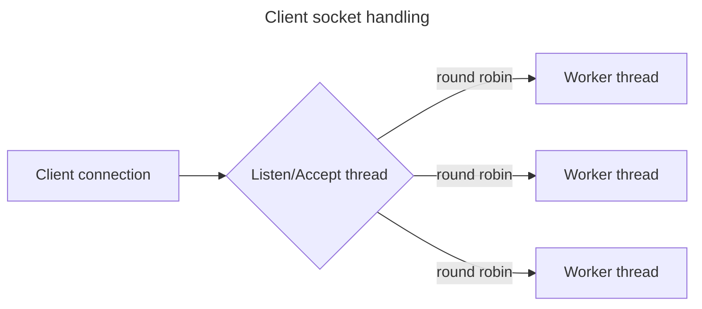
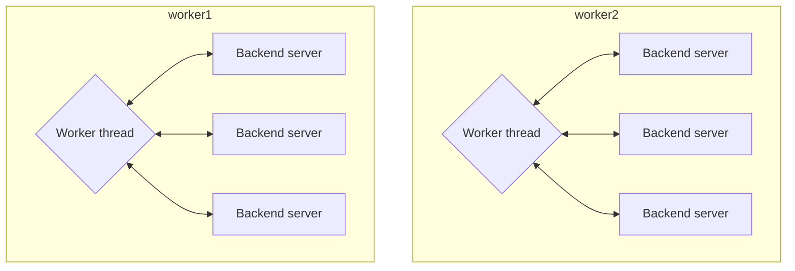
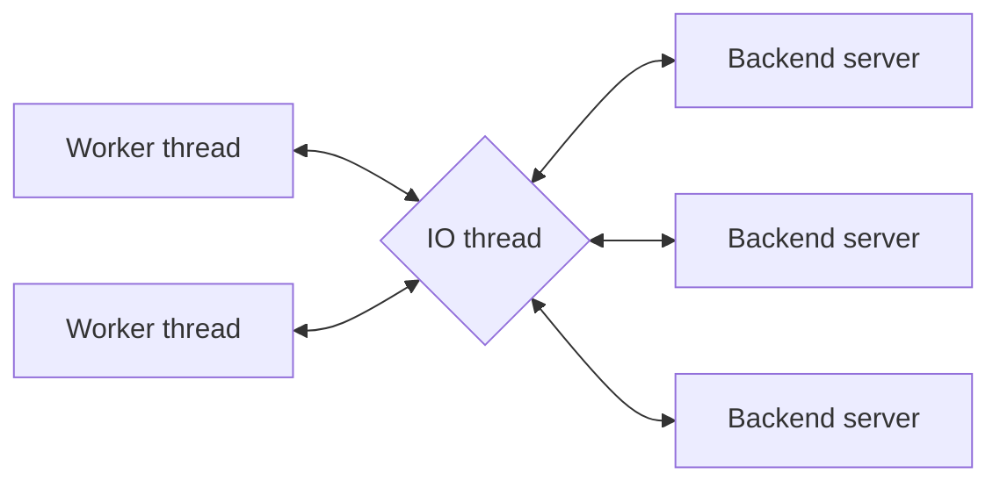
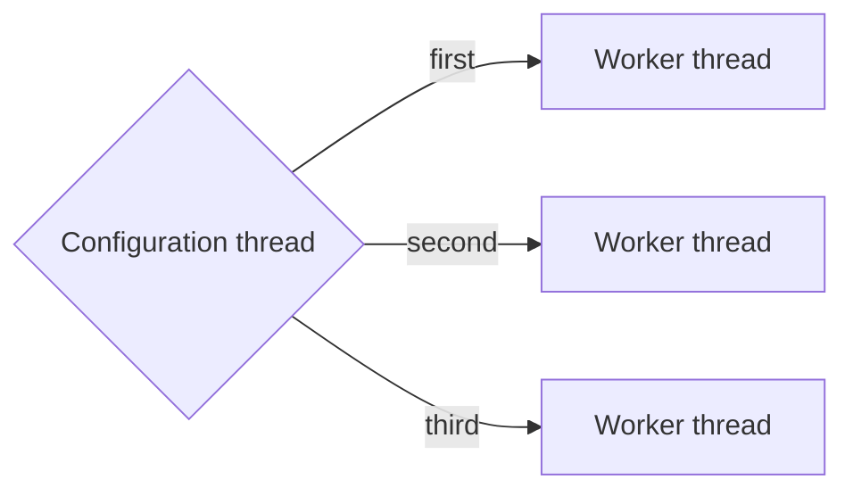
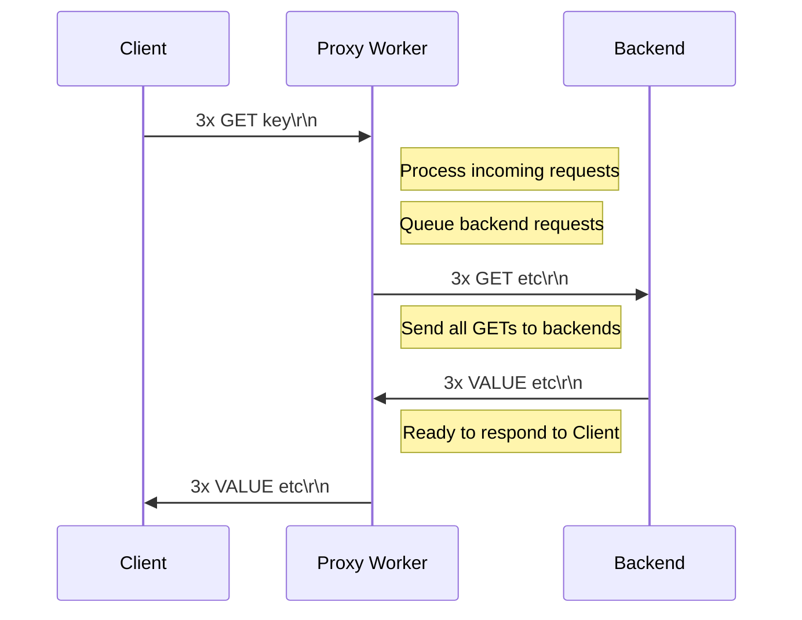
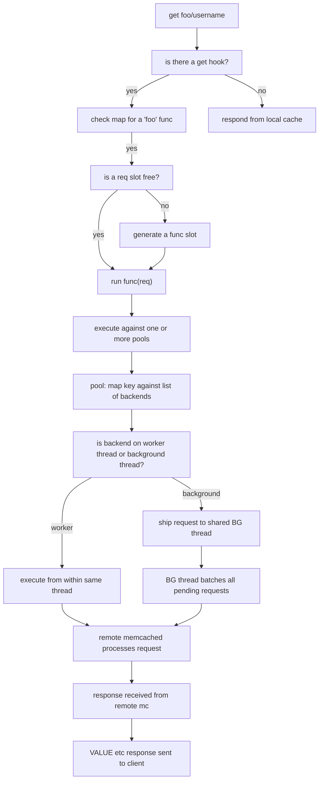

+++
title = 'Internal Architecture'
date = 2024-09-01T09:10:49-07:00
weight = 60
+++

This page describes the workings of the Memcached built-in proxy in detail.

For a general overview of the built-in proxy, see [Built-in proxy]().

## Client connections and workers

Client connections to the proxy are handled exactly the same as a normal
memcached. A dedicated thread listens for new sockets, and distributes client
connections to each worker thread in a round robin.

Each worker gets a dedicated Lua VM: Lua data cannot be directly shared between
worker threads.

There are no dedicated "proxy" worker threads. A worker thread may handle
cache responses or proxy requests. Lua for request handling is _only executed
in a worker thread_.



## Backend requests and connections

Backend requests may either come directly from a worker thread (if `iothread =
false` in pool settings). Each worker thread has a dedicated TCP connection to
each backend server.



Or, if `iothread = true`, workers will submit requests to a dedicated IO
thread, which will batch up requests to the same backend if possible. In this
mode we will use fewer total TCP sockets.

This IO thread does not contain any Lua processing, it is pure C and only
handles the networking and protocol parsing on response data.



## Configuration load and reload

A separate Lua configuration thread processes the config file, executes `mcp_config_pools` and creates all of the backend and pool objects. It then copies the configuration to each worker VM. The worker VM's each execute `mcp_config_routes` on load; it is important to keep this function lightweight.

The configuration thread has its own dedicated Lua VM. It shares data to the
worker VM's by doing a specialized cross-VM data copy of the results returned
from `mcp_config_pools()`

The load process runs against one worker thread at a time. First, because the
configuration thread has to copy some data into each worker, and second to
minimize the latency impact of reload.



---

## Client and backend request batching

### Batching client requests

Multiple requests from a single client socket may be batch processed. This
improves performance by reducing the number of syscalls and context switches,
but has some caveats.

For the proxy, _client request batching_ works exactly the same as a normal
memcached, as the code is shared. They differ when it comes time to return a
response to the client.

For example, lets take client A and proxy P:
- Client A makes a TCP write() call with a buffer containing three requests at
  the same time:
```
get foo\r\n
get bar\r\n
get baz\r\n
```

- A worker thread on proxy P now gets woken up with a notification that data is ready on the socket for client A.
- The proxy now issues a read() against the socket, for up to `READ_BUFFER_SIZE` (16kb) bytes.
- The read buffer is large enough to hold all three requests, and the proxy begins to parse the buffer.
- The proxy first executes `get foo`, which resolves to backend `b1`.
- The request is now queued to be executed by `b1`, and `get foo` is now suspended while waiting for a response.
- The proxy _immediately moves to the next request_, starting `get bar`. Which goes to backend `b2` and so on.
- The process repeats until the proxy runs out of client requests or hits a yield limit (see below)

Now that the proxy has nothing to return to Client A, because it is waiting on
three parallel requests to different backends. It will suspend the processing
of Client A.

Once _all queued responses are collected_ Proxy P will resume and send all
results back to Client A. This means the Time To First Byte for the response
to Client A will be the speed of the slowest backend server.

If more requests arrive at Client A's socket while it is already suspended,
those requests cannot start until the original set completes.

NOTE: This will likely change in future versions; allowing the proxy to return
partial responses when safe, and start new requests if they arrive while
former ones are waiting.

In many cases there is either exactly one request arriving at a time, or all
backends are roughly the same speed: memcached does not typically do
processing before returning results, so all requests take the same amount of
time. In most cases performance is acceptable.



### Batching backend requests

In comparison to Client socket handling detailed above, _backend sockets_ use
full bidirectional streaming.

Take a Backend B that has received three requests from different clients
at the same time:
```
get foo\r\n
get bar\r\n
get baz\r\n
```

Backends do no processing on requests that are queued for it: all they need to
do is write these requests out to the socket connected to the backend server.
Here we will:

- Queue up all three requests into a single write syscall
- Wait for responses
- Read up to `READ_BUFFER_SIZE` (16kb) from the socket at once
- Begin processing each response in a loop:
  - Parse the response, if okay return the response object to its original client.
  - If there is another response ready in the buffer, immediately process it.
  - Once complete, go back to waiting.

If more requests arrive while Backend B is waiting for responses, it will
immediately write() them to the same socket. If the socket buffer is full, it
will wait until it can write more. Thus new requests are not delayed while
waiting for a previous batch to complete.

Responess are immediately sent to their respective Client's as they're read
off of the socket, so there is no internal delay for waiting on a batch to
process.

If Backend B breaks for some reason, the queue is immediately drained and
error responses are sent to all waiting Clients.

TODO: chart.

---

## Backend connection failure detection

---

## Configuration reload

---

## Backend and Pool object management

### Backend object lifecycle

The below API only creates a description of a backend internally. Actual
backend objects are created when `mcp.pool()` is called. This allows us to
track the lifecycle of backends with the lifecycle of pools.

IE: If pool A is created with backends 1 and 2, those backends are guaranteed
to live as long as pool A lives. If pools A and B share the same backends,
reference counting is used on the backends. Both pools A and B would need to
be de-allocated before backends 1 and 2 are removed.

This is partly done for performance reasons: since we don't have to change the
reference count or lock backends 1 and 2 when requests are being executed.
Basically:

- A backend can only be queried if a pool object still exists.
- Pool objects _cannot be deallocated_ anywhere when a request is being
  handled.
- Pools use a higher level memory management.
- Thus we can use everything without reference counting or locking at _request
  time_.

---

# Request flow



Almost all of the actual processing is done outside of Lua, with Lua used to primarily manage configuration as code.


