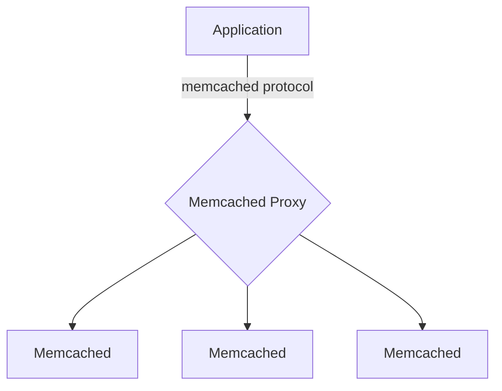
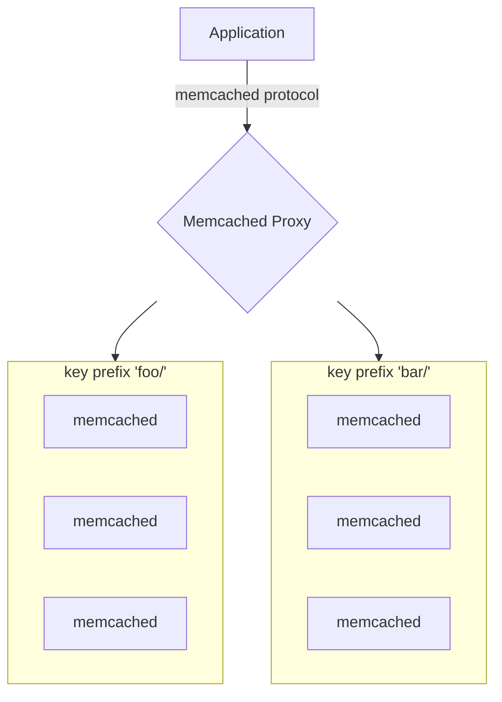
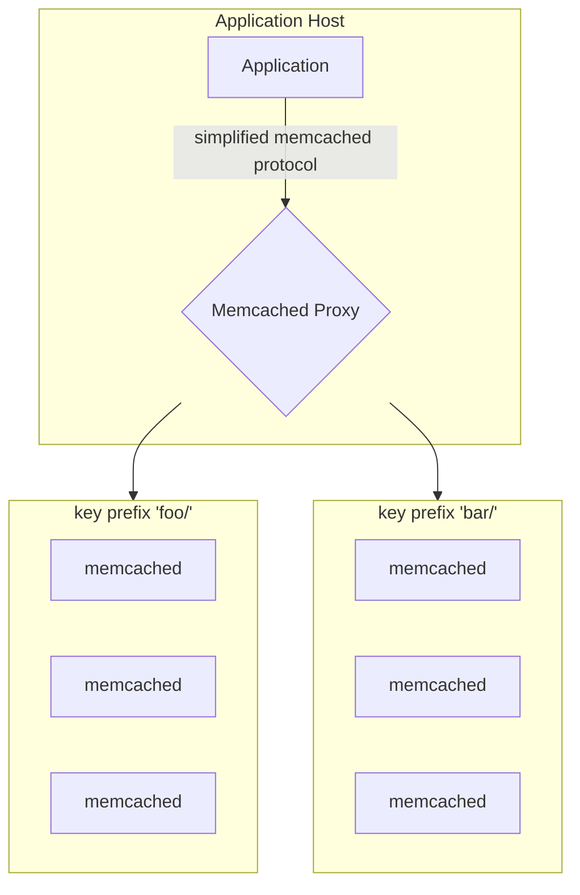
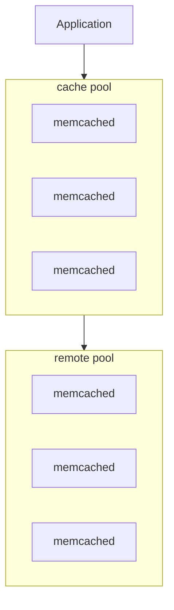

+++
title = 'Infrastructure examples'
date = 2024-09-01T09:08:32-07:00
weight = 50
+++

This page provides illustraed examples of ways that you can create load-balanced, multiple-node cacheing systems using the Memcached built-in proxy. For a general overview of the built-in proxy, see [Built-in proxy]().

The memcached proxy is a flexible and lightweight system with few
dependencies. Any memcached binary can be a proxy, a cache server, or both.
This allows us to adjust easily based on application requirements.

---

## Proxy Middleware Machine

### Middleware Architecture

The "middleware machine" deployment approach is probably a familiar design: a
machine or pool of machines sit inbetween the application servers and cache
storage nodes. This design allows centralization of pool configurations,
simplifying cache clients, and centralizing the maintenance of proxy servers.

Each cache request must first be processed by the proxy server. The proxy will
then fan-out sets of requests as necessary to backend servers and return the
results back to the client.

### Middleware Pros

- Cache configuration and cache pool maintenance is centralized.

This allows a team to maintain a complex cache structure without disturbing or
having to modify, restart, or push configuration to application servers.

- Cache client complexity is moved to the proxy layer.

Most memcached clients are "full featured": meaning they take a configuration
with a list of servers, run hash calculations, and spread requests out to
backend servers directly. This is typically the best approach as it has the
highest level of performance.

However it can be useful to instead have a _very thin_ memcached client.
Especially if you need complex features, having to update all application
programs to make changes can be a large burden on teams. This can lead to
stagnation and people try to avoid making changes.

- "Hot key caches" are possible within the proxy layer to aid performance.

Since every proxy is also a normal memcached, it is possible to create an
"L1/L2" layered cache. The details will depend highly on your needs, but doing
so can remove the added latency and CPU overhead of having extra network
requests added from having to first go through the proxy.

### Middleware Cons

- Fetching data requires going through the proxy first, adding roundtrips and
  latency.

Without the proxy, a request/response to memcached requires:

1. Write request from client
2. Read request from memcached
3. Write response from memcached
4. Read response from client

With the proxy, extra latency steps are involved:

1. Write request from client

.. wait for network..

2. Read request from proxy
3. Write request from proxy

.. wait for netork..

4. Read request from memcached
5. Write response from memcached

.. wait for network..

6. Read response from proxy
7. Write response from proxy

.. wait for network..

8. Read response from client

Note that this can vary a lot by implementation: Hot caches in the proxy, or
fetching from remote pools on miss, can still improve overall performance.

- Performance is not ideal, especially for large caches with high bandwidth usage.

If all involved machines are fast enough, high request rates can be
manageable. However if cache data is very large (hundreds of kilobytes to
megabytes), and the number of proxies is fewer than the number of cache
servers, you can quickly run out of bandwidth.

A non obvious benefit of memcached is that its distributed direct-to-client
nature means the total bandwidth capacity of the pool scales linearly with the
number of servers in the pool.

If you need 10 servers to hold all of your cache data, but only need 2 proxies
to "front" them, your bandwidth is limited by the proxies, not the backend
servers.

---

## Application Sidecar

### Sidecar Architecture

In a "sidecar" style deployment, each application server runs a proxy
co-located on its host. This can be by binary deployment, container, and so
on.

This provides a compromise between having full _border proxies_ and having
_fat clients_ directly inside the application. The sidecar can abstract pool
configuration, fan-out, key distribution, upgrading the proxy, etc, away from
an application client, simplifying maintenance.

It's also possible to mix these approaches: some applications may work better
with a local sidecar (high bandwidth) and some might use a centralized pool
(less cache usage, so simplify deployments).

### Sidecar Pros

- Scales similar to memcached without a proxy: no limits on bandwidth or
  request rate.

- More work than maintaining a small centralized pool, but still allows
  proxies to be updated without adjusting an application server.

- Allows applications to use simplified clients still.

### Sidecar Cons

- Must manage deployments on every application server, instead of one pool
  centrally.

- Add some CPU overhead to application servers.

- Still requires extra system calls: between client and local proxy, then out
  to remote servers and back.

Generally the overhead of local connections is low, but this must be verified
because "container systems" can add significant overhead.

## Cache Layering Proxy

### Cache Layering Architecture

A layered cache is an architecture where a pre-existing pool of memcached
servers is replaced by proxy nodes. A standard client is used, which hashes
keys and distributes them across proxy nodes. The nodes themselves then may
execute extra work.

This extra work could be copying `set` commands to remote pools, fetching from
remote pools on a miss, or fetching from remote pools for specific namespaces.
This makes sense if you want to store long tail cold data on cheaper servers,
or if you have some key namespaces which have a long tail of data, but not a
high request rate.

It can also be a good gateway into deploying the proxy into an existing
memcached pool.

### Cache Layering Pros

- If you already have memcached deployed but want to add redundancy,
  expansion, or so on.

- Keep your most commonly used cache data in the top layer for good
  performance.

### Cache Layering Cons

- Needs more complex application clients.

- Configuration of pools needs to be managed in two places (application
  clients, memcached proxies)
